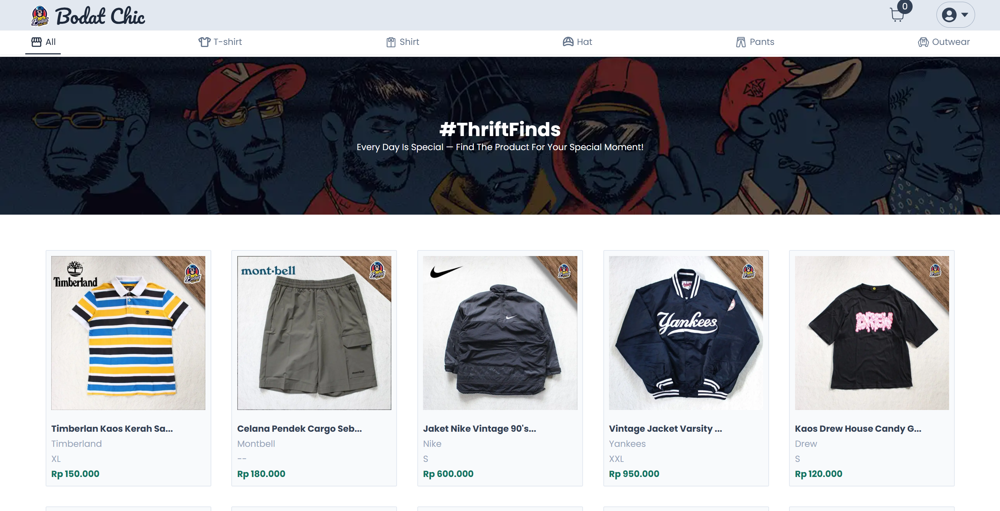
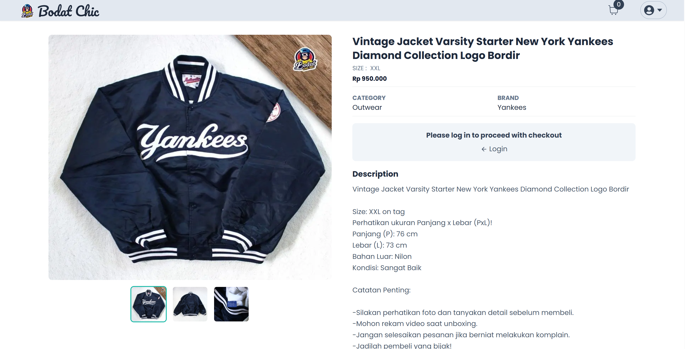
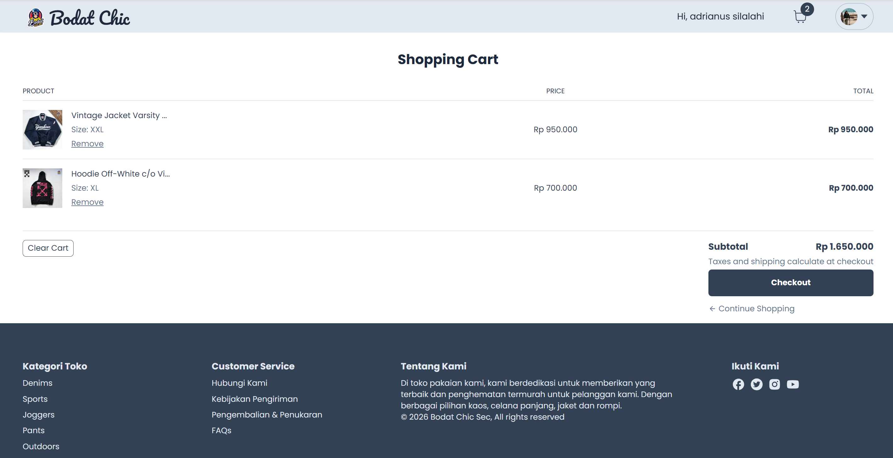
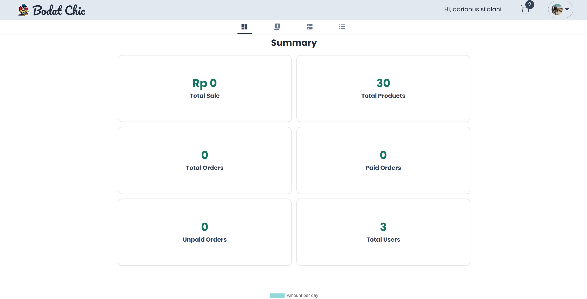
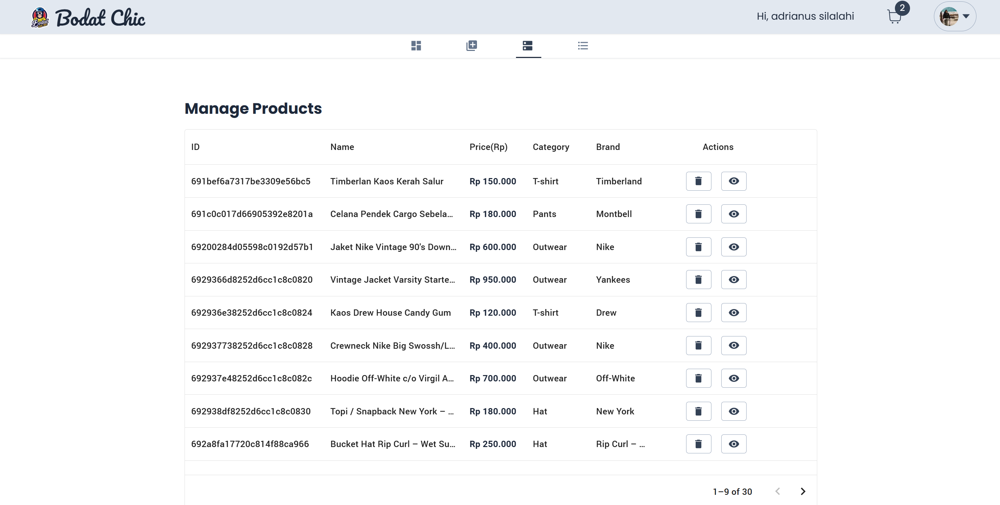

# Bodat Chic SEC 👗

> A full-stack e-commerce platform built to support a personal thrift fashion business — featuring a complete shopping experience and a custom admin dashboard.

[](https://www.bodat-chic-sec.shop)
[](https://nextjs.org)
[](https://typescriptlang.org)
[](https://mongodb.com)

---

## 📌 Overview

**Bodat Chic SEC** is a personal e-commerce platform designed for selling second-hand (thrift) fashion items. Because each item is pre-owned, every product has a stock of exactly **1** — once sold, it's gone.

The platform combines a polished storefront for customers with a purpose-built admin dashboard for the business owner to manage inventory, monitor sales, and track key metrics in real time.

> ⚠️ **Note:** Payment via Stripe is currently in **test/demo mode**. No real transactions are processed. Use Stripe test card `4242 4242 4242 4242` to simulate checkout.

---

## ✨ Features

### 🛍️ Storefront
| Feature | Description |
|---|---|
| **Product Catalog** | Browse all available thrift items with images, prices, and categories |
| **Category Filter** | Filter products by clothing type, gender, brand, etc. |
| **Product Detail** | View full product info, condition notes, and sizing |
| **Shopping Cart** | Add items, review order, and proceed to checkout |
| **Checkout & Payment** | Secure checkout flow powered by Stripe (test mode) |
| **Authentication** | Sign in / Sign up via NextAuth (credentials & OAuth) |

### 🔧 Admin Dashboard
| Feature | Description |
|---|---|
| **Real-time Analytics** | 6 key business metrics: total orders, revenue, users, inventory count, paid checkouts, unpaid checkouts |
| **Product Management** | Add, edit, and delete products with image upload |
| **Order Tracking** | View all orders with payment status (paid / unpaid) |
| **Inventory Control** | Each product is automatically marked as sold-out after purchase |

---

## 🖥️ Live Demo

🔗 **[www.bodat-chic-sec.shop](https://www.bodat-chic-sec.shop)**

**Test Checkout:**
```
Card Number : 4242 4242 4242 4242
Expiry      : Any future date (e.g. 12/26)
CVC         : Any 3 digits
```

---

## 🏛️ Architecture

```
┌──────────────────────────────────────────┐
│              USER BROWSER                │
│    Next.js 15 App Router + TypeScript    │
│        (Vercel — Global CDN)             │
└──────────────┬───────────────────────────┘
               │ API Routes / Server Actions
               ▼
┌──────────────────────────────────────────┐
│           NEXT.JS API LAYER              │
│  ┌────────────┐  ┌──────────────────┐   │
│  │  NextAuth  │  │  Stripe Webhook  │   │
│  │  (Auth)    │  │  (Payment)       │   │
│  └────────────┘  └──────────────────┘   │
└──────────────┬───────────────────────────┘
               │ Mongoose ODM
               ▼
┌──────────────────────────────────────────┐
│           MONGODB ATLAS                  │
│  Collections: users, products, orders    │
└──────────────────────────────────────────┘
```

---

## 🛠️ Tech Stack

| Technology | Purpose |
|---|---|
| **Next.js 15** (App Router) | Full-stack React framework |
| **TypeScript** | Type safety across the codebase |
| **MongoDB Atlas** + Mongoose | Database & ODM |
| **NextAuth.js** | Authentication (session management, OAuth) |
| **Stripe** | Payment processing (test mode) |
| **Tailwind CSS** | Utility-first styling |
| **Vercel** | Deployment & hosting with CI/CD |
| **Node.js** | Runtime environment |

---

## 📸 Screenshots

### Storefront — Product Catalog


### Product Detail


### Shopping Cart & Checkout


### Admin Dashboard — Analytics


### Admin — Product Management


---

## 🚀 Running Locally

### Prerequisites
- Node.js 18+
- MongoDB Atlas account (or local MongoDB)
- Stripe account (for test keys)

### Setup

```bash
# Clone the repository
git clone https://github.com/Adrian-Silalahi/bodat-chic-sec.git
cd bodat-chic-sec

# Install dependencies
npm install

# Configure environment variables
cp .env.example .env.local
```

Fill in your `.env.local`:
```env
# MongoDB
MONGODB_URI=mongodb+srv://...

# NextAuth
NEXTAUTH_URL=http://localhost:3000
NEXTAUTH_SECRET=your-secret-key

# Stripe (test keys)
STRIPE_PUBLIC_KEY=pk_test_...
STRIPE_SECRET_KEY=sk_test_...
STRIPE_WEBHOOK_SECRET=whsec_...
```

```bash
# Start the development server
npm run dev
```

App will be available at `http://localhost:3000`

---

## 📁 Project Structure

```
bodat-chic-sec/
├── app/                    # Next.js App Router pages
│   ├── (store)/            # Customer-facing pages
│   ├── admin/              # Admin dashboard pages
│   └── api/                # API route handlers
├── components/             # Reusable UI components
│   ├── navbar/
│   ├── footer/
│   └── ...
├── lib/                    # DB connection, auth config, utils
├── models/                 # Mongoose schema definitions
├── public/
│   └── screenshots/        # App screenshots
└── types/                  # TypeScript type definitions
```

---

## 💡 Design Decisions

- **Stock = 1 per item**: Since all items are pre-owned, inventory logic is simplified — products are marked unavailable immediately after checkout, preventing overselling.
- **Stripe Test Mode**: Full payment flow is implemented and functional in test mode. Switching to live mode requires only updating the API keys.
- **App Router**: Leverages Next.js 15 server components and server actions for optimal performance and reduced client-side JavaScript.

---

## 👤 Author

**Adrianus Silalahi**  
[](https://github.com/Adrian-Silalahi)

---

## 📄 License

This project is a personal portfolio project. All rights reserved © 2025 Adrianus Silalahi.
